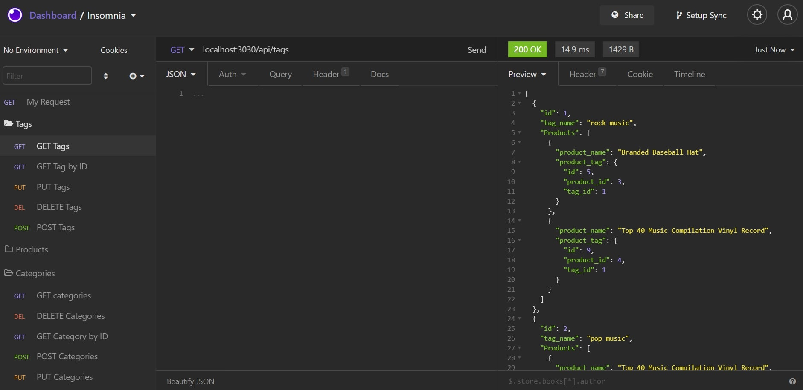
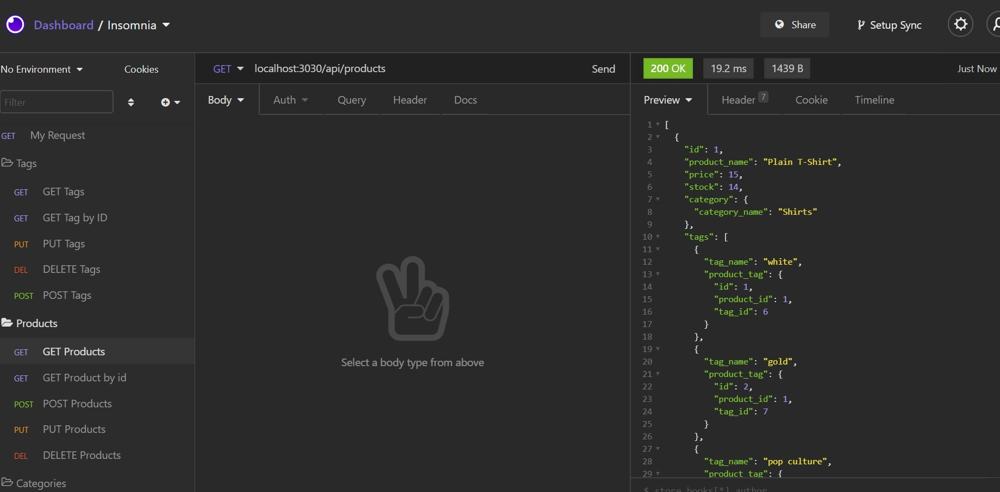
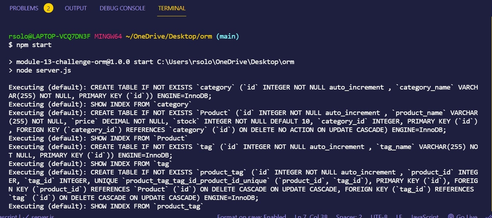

# Rachel-s-E-commerce-Back-End

## Table of Contents

- [User Story](#user-story)
- [Instructions](#instructions)
- [Github Profile](#github-profile)
- [Link to E-commerce Back-end](#link-to-employee-tracker)
- [Contribution](#contribution)
- [License](#license)

### **User Story**

AS A manager at an internet retail company
I WANT a back end for my e-commerce website that uses the latest technologies
SO THAT my company can compete with other e-commerce companies

### **Instructions**

View this Screentastify link for instructions:

-(https://drive.google.com/file/d/14XjwNbJawkXBsQoUlBKSOKY3fs51mmUY/view)

### **Github Profile**

https://github.com/rsolov23

### **Link to my Employee Tracker**

- https://github.com/rsolov23/Rachel-s-E-commerce-Back-End

### **Contribution**

Feel free to contribute to this project in any of the following ways:

- [Submit bug and feature requests](https://github.com/rsolov23/Rachel-s-E-commerce-Back-End/issues)
- [Review Source Code Changes](https://github.com/rsolov23/Rachel-s-E-commerce-Back-End/pulls) and make pull requests from typos to content

### **License**

Licensed under the [MIT License](https://github.com/rsolov23/Rachel-s-E-commerce-Back-End/blob/main/LICENSE)

Copyright (c) 2021 Rachel Solov
